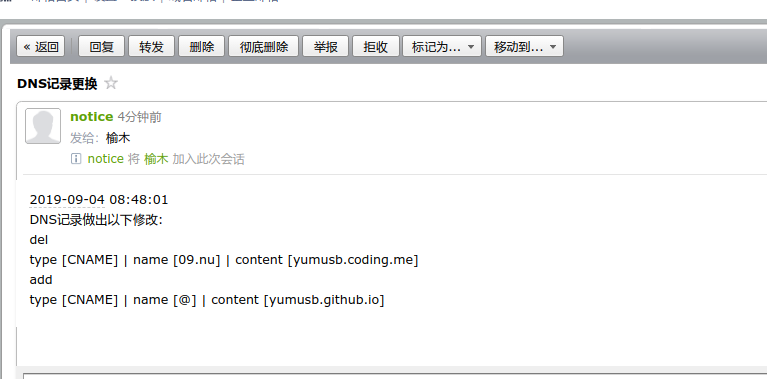

## AutoChangeDns (自动切换DNS记录)

实现功能：根据本机ping相关域名解析的记录值，检测存活,宕机自动删除记录，并添加存活的记录。发送邮件到相关配置  

注意：`此版本根据ping值进行检测，所以可能会有所不准确，如果有好用的云监控，请提交给我`  

开始:
``` shell 
 git clone https://github.com/yumusb/AutoChangeDns.git  
 cd AutoChangeDns
 pip3 install -r requirements.txt  
 #修改config.yml中的配置文件
 python3 jiankong.py
```

邮件内容：  

